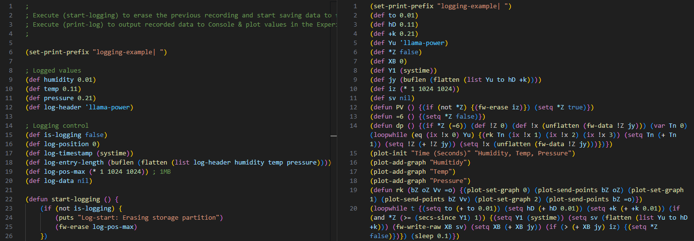

# lbm_obfuscator

`lbm_obf.py` is a purpose-built tool that compacts large LispBM applications so they *might* fit when embedded into a VESC firmware image. Even though the runtime Lisp partition can store roughly 125 KB, the firmware updater pushes the script through the `flash2` region during linking -- and `flash2` is tiny (about 475 KB shared with other code).

`lbm_obf.py` shrinks the script as much as possible to increase the chance that the firmware image plus embedded Lisp still fits in `flash2` and can be delivered via a normal firmware update, but it cannot guarantee success for very large projects.

> [!WARNING]
> This project is highly experimental and was drafted with the help of AI tooling. Review the generated output carefully before deploying it to hardware.



## Features

- **Import inlining** - `(import "...") + (read-eval-program ...)` sequences are resolved recursively so the final output is a single `.lbm` file that VESC can embed directly. Cycles fall back to the original forms.
- **Debug/diagnostic stripping** - `vt-*` definitions, `update-vt` helpers, and any `loopwhile-thd` blocks that rely on them are removed to keep telemetry code out of production binaries.
- **Print removal** - All `(print ...)` / `(puts ...)` calls are deleted (while leaving quoted data alone) so idle logging does not waste bytes or CPU.
- **Whitespace trimming** - Blank lines and redundant spaces inside parentheses/brackets/braces are collapsed for a denser payload.
- **User symbol obfuscation** - Functions, globals, and thread names are renamed through a random generator that:
  - avoids collisions with any existing symbol,
  - keeps two-character built-ins/special forms intact (thanks to the `BUILTIN_2CHAR` set),
  - never emits tokens that look like numeric literals,
  - respects lexical scope so local bindings stay unique.
- **Thread-name scrubbing** - `loopwhile-thd` string identifiers (both `"Name"` and `("Name" stack)`) are rewritten consistently to hide implementation details.

## Usage

```bash
python lbm_obfuscator/lbm_obf.py path/to/main.lbm
```

The tool writes `main_obf.lbm` next to the input file and also emits the obfuscated program to stdout (pipe it if you want to inspect or post-process further).

## Intended workflow

1. Develop your LispBM app with full logging, helper threads, and clean module boundaries.
2. Run the obfuscator before building custom firmware; it collapses everything into a single minimized file.
3. Embed the result into the VESC firmware binary.  
   - Keep in mind that `flash2` is the limiting transport during firmware updates; even though the runtime Lisp partition is bigger, the updater must carry the entire script inside `flash2` alongside ChibiOS and metadata. If `flash2` overflows, linking fails and the update cannot be delivered.
   - Place every file referenced via `(import "...")` in the same directory as the main file before running the tool. The inliner resolves imports relative to the source file, so sibling files are required for it to pull everything into a single output.

## Limitations & caveats

- **Experimental parser** - The tokenizer/AST is tuned for the LispBM dialect used in the VESC tree. Exotic reader macros or unusual quoting forms may break parsing.
- **Import assumptions** - Only the `(import "...")` followed immediately by `(read-eval-program <sym>)` pattern gets inlined. Other ways of loading code are left untouched.
- **Reserved-symbol heuristics** - The built-in avoidance list is based on known two-character tokens plus what already exists in the source tree. Future firmware versions might add more built-ins; update `BUILTIN_2CHAR` as needed.
- **Logging removal** - All prints are stripped unconditionally. If you rely on runtime `print` output for functionality, you must guard those calls yourself before running the obfuscator.
- **Thread-name collisions** - Thread names are obfuscated independently from symbols, but they are still strings. If your system depends on specific textual names (for IPC, for example), you'll need to skip those threads manually.
- **AI-generated / rapidly evolving** - Large parts of the script were iterated with AI assistance. Tests only cover a handful of in-tree programs; treat the output as untrusted until you have verified it on your hardware.

## Development notes

During development the following directions were explored:

- deterministic name generators vs. random per-build names (random won to minimize collision risk with short identifiers),
- multi-pass AST pruning to ensure that `update-vt` logging logic disappears both at the definition site and all call sites,
- conservative handling of quoted data so `(quote (vt-* ...))` blobs survive untouched,
- recursive import resolution with a guard against infinite loops for cyclic dependency graphs,
- obfuscating the key side of association lists (e.g. `(my-fun 'kurt-russel '(apa . 10) '(bepa . 20) '(kurt-russel . is-great))`) to hide table names while keeping values intact. This idea was tested but ultimately left disabled because it risked breaking user data structures.

> [!TIP]
> Contributions and bug reports are welcome--especially improvements that keep the generated code small enough to fit in `flash2` without sacrificing runtime safety.
